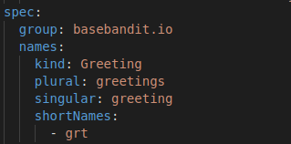

# Custom Resource Definition (CRD)
The **CustomResourceDefinition** API resource allows you to define custom resources:  
In this project we create a CRD using the below approach: 
- Define **CustomResourceDefinition** using YAML
- Create custom resources using YAML

Later we will add more functionality, for example if we want our CRDs to work like Pods?  
- Once CRD is created, Create new **Custom Controller** on resource handling create/update/delete events.  
- To achieve that, we will build a Custom Controller and deploy it to work as an aggregated API for **declarative resources** using Kubernetes CRDs and kubectl.

## Requirements
- Have a k8s cluster up and running. (minikube would do perfectly fine)
- Create the CRD.  
`kubectl apply -f crd-greeting.yaml`
- Confirm the resource has been successfully created.  
```bash
NAME         SHORTNAMES   APIVERSION                        NAMESPACED   KIND
...
greetings    grt          basebandit.io/v1alpha1            true         Greeting
...
```
- Go ahead and now create a resource using our above CRD.
`kubectl apply -f test-greeting.yaml`
- Confirm it is successfully created.  
```bash
└──╼ $ k get greetings                    
NAME                  AGE
basebandit-greeting   19m
┌─[lab@basebandit]─[~/github.com/basebandit/kubernetes/crd-greeting] [main ⚡] 
└──╼ $ k get greeting                     
NAME                  AGE
basebandit-greeting   19m
┌─[lab@basebandit]─[~/github.com/basebandit/kubernetes/crd-greeting] [main ⚡] 
└──╼ $ k get grt     
NAME                  AGE
basebandit-greeting   19m
```
**Note:** You can switch the name resource name *greetings* with any of the names you declared in the CRD spec definition.



